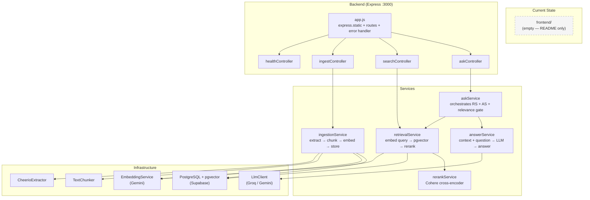

# Phase 2.1 Architectural Decision Record — Frontend ↔ Backend Integration

> **Status:** Draft  
> **Date:** 2026-09-30  
> **Scope:** Frontend ↔ Backend integration layer only  
> **Phase:** 2.1 (subset of Phase 4 in the project roadmap)

---

## 1. Phase 2.1 Objective

Phase 1 delivered a fully functional RAG pipeline accessible only through raw HTTP requests (cURL, Postman, test scripts). There is no user-facing interface. Phase 2.1 bridges that gap:

```text
React Frontend (new)
      │
      ▼
Backend API (existing — Express on port 3000)
      │
      ▼
Existing RAG Pipeline
  extract → chunk → embed → pgvector → rerank → LLM
      │
      ▼
Answer + Sources
      │
      ▼
React Frontend (renders result)
```

**Why this is the next step.** The backend is complete — extraction, chunking, embeddings, vector storage, retrieval, Cohere reranking, and grounded LLM answer generation all work end-to-end. The project roadmap (`docs/roadmap.md`) places "Frontend & Browser Extension" as Phase 4, but the backend API surface is already stable enough to build against. Adding a minimal frontend now validates the API contract with a real consumer before the pipeline grows more complex (Playwright scraping in Phase 2, Neo4j in Phase 3). It also provides a practical feedback loop for identifying UX-level issues in response formatting, latency perception, and error messaging.

Phase 2.1 is deliberately scoped to **integration plumbing only** — connecting a React frontend to the four existing endpoints — not to building a polished product UI.

---

## 2. Current Architecture

### 2.1 Repository Structure

```text
WebMind/
├── backend/                    # Node.js + Express
│   ├── src/
│   │   ├── app.js              # Express app, routes, error handler
│   │   ├── server.js           # Entry point — dotenv, initDb, listen
│   │   ├── routes/             # health, ingest, search, ask
│   │   ├── controllers/        # healthController, ingestController, searchController, askController
│   │   ├── services/           # ingestionService, retrievalService, answerService, askService, rerankService
│   │   ├── extractors/         # CheerioExtractor behind extract() abstraction
│   │   ├── chunking/           # TextChunker (paragraph-aware, configurable overlap)
│   │   ├── embeddings/         # EmbeddingService (Gemini batchEmbedContents)
│   │   ├── llm/                # LlmClient (dual-provider: Groq via OpenAI SDK, Gemini via fetch)
│   │   ├── db/                 # pg Pool, schema init (pgvector), repository (upsert, search)
│   │   ├── config/             # chunkingConfig, embeddingConfig, llmConfig, rerankConfig
│   │   ├── logging/            # evalLogger (JSONL for /ask requests)
│   │   ├── middleware/         # empty (.gitkeep only — no CORS, no auth)
│   │   └── utils/              # errors.js (WebMindError, ExtractionError, ValidationError),
│   │                             logger.js (structured, redacts sensitive fields), urlValidator.js
│   ├── evaluation/             # Canonical eval dataset + runner (npm run eval)
│   ├── tests/                  # 9 integration/unit test files (no test framework in package.json)
│   ├── .env / .env.example     # Configuration
│   └── package.json            # Express, Cheerio, dotenv, openai, pg — no CORS package
├── frontend/                   # Placeholder — contains only README.md
│   └── README.md               # "reserved for the future Web UI and Chrome Extension"
├── docs/
│   └── roadmap.md              # 4-phase roadmap
└── README.md
```

### 2.2 Backend Framework

- **Runtime:** Node.js (ES Modules — `"type": "module"`)
- **Framework:** Express 4.19.2
- **Database:** PostgreSQL via `pg` 8.23.0 + `pgvector` extension (Supabase-hosted)
- **Dependencies (production):** `cheerio`, `dotenv`, `express`, `openai`, `pg` — 5 total

### 2.3 Existing API Endpoints

| Endpoint | Method | Handler |
|---|---|---|
| `/health` | GET | `healthController.getHealth` |
| `/ingest` | POST | `ingestController.ingestController` |
| `/search` | POST | `searchController.searchController` |
| `/ask` | POST | `askController.askController` |

All routes are mounted at root (`app.use('/', ...)`) in `app.js`.

### 2.4 AI Providers

| Provider | Purpose | SDK/Transport |
|---|---|---|
| **Google Gemini** | Embeddings (`gemini-embedding-001`, 768-dim) | REST `fetch()` |
| **Google Gemini** | LLM completions (when `LLM_PROVIDER=gemini`) | REST `fetch()` |
| **Groq** | LLM completions (when `LLM_PROVIDER=groq`) | OpenAI SDK |
| **Cohere** | Reranking (`rerank-v3.5`) | REST `fetch()` |

### 2.5 Static File Serving

`app.js` line 18 serves the `frontend/` directory as static files:

```js
app.use(express.static(path.join(__dirname, '../../frontend')));
```

This means the backend already expects to serve static frontend assets from the `frontend/` directory relative to the project root. This is relevant to the Phase 2.1 architecture (see Section 3).

### 2.6 CORS Configuration

**There is none.** No `cors` package in `package.json`, no CORS middleware in `app.js`, no files in `middleware/`. The directory contains only a `.gitkeep`. This is not a problem when the frontend is served as static files from the same Express server (same-origin), but it will block requests if the React dev server runs on a different port.

### 2.7 Error Handling

The backend uses a typed error hierarchy:

- `WebMindError` (base) — `code`, `status` fields
- `ExtractionError` extends `WebMindError`
- `ValidationError` extends `WebMindError`

Controllers catch typed errors and return structured JSON: `{ error, code, status }`. Unhandled errors fall through to the global error handler in `app.js` which returns the same shape with a 500 status.

### 2.8 Architecture Diagram



---

## 3. API Communication Decision

### Problem

The React frontend needs to communicate with the Express backend. Which communication pattern should be used?

### Options Compared

| Criteria | REST (JSON) | GraphQL | WebSockets | Server-Sent Events (SSE) |
|---|---|---|---|---|
| **Advantages** | Simple; matches existing endpoints; universal tooling; cacheable; stateless | Flexible queries; single endpoint; client controls response shape | Bidirectional real-time; persistent connection | Server-push; built on HTTP; auto-reconnect | 
| **Disadvantages** | Multiple round trips for complex data; over/under-fetching possible | Schema overhead; complexity for 4 endpoints; learning curve; caching harder | Connection management complexity; not HTTP-cacheable; overkill for request-response | Unidirectional (server → client); no request-response semantics |
| **Complexity** | Low | Medium–High | High | Low–Medium |
| **Suitability for WebMind** | **High** — 4 existing endpoints with well-defined request/response shapes | Low — the API surface is small and stable; GraphQL adds overhead without benefit | Low — WebMind is request-response, not real-time collaborative | Medium — useful for streaming LLM tokens in the future, not needed now |

### Decision: REST (JSON over HTTP)

**Reason:** The backend already exposes four REST endpoints (`/health`, `/ingest`, `/search`, `/ask`) with stable request/response contracts. The API surface is small, the data shapes are predictable, and every interaction follows a simple request → response pattern. Switching to GraphQL would add schema definition overhead, a new dependency, and query parsing complexity — all for an API with four endpoints and no nested-resource querying needs. WebSockets would add connection lifecycle management for what is fundamentally a stateless request-response flow.

### Streaming Consideration

The `/ask` endpoint currently returns the full LLM answer in a single JSON response. Streaming the LLM response token-by-token via SSE would improve perceived latency — the user sees text appearing progressively instead of waiting for the full generation.

**Decision: Defer streaming to a later phase.** Reasons:

1. The `LlmClient` does not implement streaming — both `_groqCompletion` and `_geminiCompletion` `await` the full response.
2. Adding SSE requires changes to the backend controller (streaming response), the LLM client (streaming API calls), and the frontend (EventSource consumption) — three layers of change that are outside the scope of integration plumbing.
3. Current `LLM_MAX_TOKENS` is 768 — response generation is relatively fast for short answers. The latency bottleneck is more likely embedding generation and vector search than LLM output streaming.
4. The eval logger (`logAskRequest`) expects a complete answer string. Streaming would require buffering the full response before logging.

Streaming can be added as a follow-up phase without changing the REST contract — the `/ask` endpoint would accept an optional `stream: true` parameter and switch to `text/event-stream` content type.

---

## 4. Frontend API Client Decision

### Problem

How should the React frontend make HTTP requests to the backend? The approach affects maintainability, error handling, testability, and future extensibility (e.g., adding auth headers).

### Options Compared

| Criteria | Direct `fetch()` in components | Centralized API service module | Axios |
|---|---|---|---|
| **Maintainability** | Poor — base URL, headers, error handling duplicated across components | Good — single place for URL construction, headers, error parsing | Good — similar to centralized service, with interceptors |
| **Reusability** | Low — each component builds its own requests | High — components call `api.ingest(url)` | High — similar |
| **Error handling** | Scattered — each component must parse errors | Centralized — service normalizes backend error shapes | Centralized — interceptors can normalize |
| **Testing** | Hard — must mock `fetch` in every component test | Easy — mock the service module | Easy — mock axios instance |
| **Environment config** | Must read env var in every call site | Reads `API_BASE_URL` once at module level | Configured once in instance |
| **Future auth** | Add header in every component | Add header in one place | Add interceptor |
| **Extra dependency** | None | None | Yes (`axios` ~450KB unpacked) |

### Decision: Centralized API Service Module Using `fetch()`

Create a single `src/api/webmindApi.js` module that:

1. Reads `API_BASE_URL` from environment config once
2. Exports named functions: `checkHealth()`, `ingestUrl(url)`, `searchChunks(query, topK)`, `askQuestion(question)`
3. Handles response parsing and error normalization in one place
4. Returns typed response objects or throws structured errors

**Reason:** The browser `fetch()` API is sufficient for JSON request-response calls. Adding Axios introduces a dependency for features WebMind doesn't need yet (request cancellation, progress events, interceptors). A centralized service module gives the same organizational benefits (single base URL, centralized error handling, easy to mock in tests) without an additional package. This approach has zero dependencies and works identically in development and production.

The backend already uses `fetch()` throughout (embedding service, rerank service, Gemini LLM client). Keeping the same pattern on the frontend maintains consistency across the codebase.

---

## 5. Environment Configuration Decision

### Problem

The React frontend needs to know the backend's base URL. This URL differs between development (`http://localhost:3000`) and production. How should it be configured, and how do we ensure backend secrets are never exposed?

### Safe Frontend Configuration

The frontend needs exactly **one** environment variable:

```text
VITE_API_BASE_URL=http://localhost:3000
```

(Prefixed with `VITE_` because Vite only exposes variables with this prefix to client code, preventing accidental leakage of other env vars.)

This is accessed via `import.meta.env.VITE_API_BASE_URL` in the React code.

### Backend-Only Secrets (MUST NEVER reach the frontend)

The following exist in `backend/.env` and must remain server-side only:

| Variable | Why it's secret |
|---|---|
| `DATABASE_URL` | Contains Supabase credentials with full database access |
| `GEMINI_API_KEY` | Google API key — billing, rate limits |
| `GROQ_API_KEY` | Groq API key — billing, rate limits |
| `COHERE_API_KEY` | Cohere API key — billing, rate limits |

**Why secrets must never be exposed:** Any environment variable bundled into a frontend build is embedded as a plaintext string in the JavaScript bundle. The browser's DevTools, `View Source`, or any network proxy can read it. Exposed API keys allow anyone to make billed API calls, exhaust rate limits, or access the database directly.

### Architecture Guarantee

The backend `.env` lives at `backend/.env`. The frontend will have its own `.env` at `frontend/.env`. Vite's env loading only reads from the frontend directory and only exposes `VITE_`-prefixed variables. There is no mechanism by which backend secrets leak into the frontend bundle.

### Production Consideration

In production, if the frontend is served from the same Express server (using the existing `express.static` line in `app.js`), the `API_BASE_URL` can be an empty string or `/` (same-origin requests). The env variable still controls this — no code change needed.

---

## 6. CORS Decision

### Problem

Cross-Origin Resource Sharing (CORS) policy will block the React dev server (e.g., `http://localhost:5173`) from making requests to the Express backend (`http://localhost:3000`) because they are different origins. How should this be handled?

### Current Configuration

**None.** Inspecting the codebase:

- No `cors` package in `backend/package.json`
- No CORS middleware in `backend/src/app.js`
- `backend/src/middleware/` contains only `.gitkeep`
- No `Access-Control-Allow-Origin` headers set anywhere

Currently, the only consumer of the API is test scripts and cURL — same-origin restrictions don't apply to non-browser contexts.

### Why This Becomes a Problem

When a React dev server at `http://localhost:5173` makes a `fetch()` to `http://localhost:3000/ask`, the browser blocks the response because:

1. The origins differ (different ports = different origins per the Same-Origin Policy)
2. The server doesn't return `Access-Control-Allow-Origin` headers
3. `POST` requests with `Content-Type: application/json` trigger a CORS preflight (`OPTIONS` request), which also fails

### Decision: Add the `cors` npm Package With Environment-Aware Configuration

**Development:** Allow the Vite dev server origin:

```js
// Allowed origin: http://localhost:5173 (Vite default)
```

**Production:** When the frontend is served from the same Express server via `express.static`, all requests are same-origin. CORS headers are not required but can remain permissive for the same origin without harm.

**Wildcard origins (`*`) should not be used**, even in development. While it would "work," it trains bad habits and masks misconfigured origins. The allowed origin should be explicit.

### Implementation Approach

Add `cors` as a backend dependency and configure it in `app.js` before routes:

```js
import cors from 'cors';

app.use(cors({
  origin: process.env.CORS_ORIGIN || 'http://localhost:5173',
}));
```

Add `CORS_ORIGIN` to `.env.example`. This keeps the configuration explicit and environment-driven.

---

## 7. API Contract Decision

### Problem

The frontend must know the exact shape of each API request and response. The following is documented from the **actual controller and service implementations**, not from assumptions.

### Endpoint Contracts

| Endpoint | Method | Request Body | Success Response | Purpose |
|---|---|---|---|---|
| `/health` | `GET` | None | `{ status, message, database, timestamp }` | Backend + database liveness check |
| `/ingest` | `POST` | `{ "url": "https://..." }` | `{ source_url, title, chunks_created, status }` | Extract, chunk, embed, and store a webpage |
| `/search` | `POST` | `{ "query": "...", "topK": 5 }` | `{ query, topK, results_count, results: [...], timings }` | Semantic vector search over stored chunks |
| `/ask` | `POST` | `{ "question": "..." }` | `{ answer, sources: [...], timings, usage, finish_reason }` | Full RAG pipeline — retrieval + LLM answer |

### Detailed Response Shapes

#### `GET /health`

```json
// 200 — healthy
{
  "status": "ok",
  "message": "WebMind API is running",
  "database": "connected",
  "timestamp": "2026-09-30T16:00:00.000Z"
}

// 500 — degraded (API running, database down)
{
  "status": "degraded",
  "message": "WebMind API is running, but database connection failed",
  "database": "disconnected",
  "error": "connection refused",
  "timestamp": "2026-09-30T16:00:00.000Z"
}
```

#### `POST /ingest`

```json
// Request
{ "url": "https://example.com/page" }

// 200 — success
{
  "source_url": "https://example.com/page",
  "title": "Example Page Title",
  "chunks_created": 12,
  "status": "success"
}

// 400 — missing URL
{ "error": "Request body must contain a non-empty \"url\" string.", "code": "MISSING_URL", "status": 400 }

// 400 — invalid URL format
{ "error": "Invalid URL format: not-a-url", "code": "VALIDATION_ERROR", "status": 400 }

// 415 — unsupported content type
{ "error": "Unsupported content-type 'application/pdf'. Expected HTML or plain text.", "code": "UNSUPPORTED_CONTENT_TYPE", "status": 415 }

// 502 — network error reaching target URL
{ "error": "Network error while fetching ...", "code": "NETWORK_ERROR", "status": 502 }

// 504 — timeout fetching target URL
{ "error": "Request timed out after 15000ms ...", "code": "TIMEOUT", "status": 504 }
```

#### `POST /search`

```json
// Request
{ "query": "What is LVDT?", "topK": 5 }

// 200 — success
{
  "query": "What is LVDT?",
  "topK": 5,
  "results_count": 5,
  "results": [
    {
      "chunk_id": "https://example.com#chunk-0",
      "chunk_text": "An LVDT is a ...",
      "source_url": "https://example.com",
      "page_title": "Example",
      "similarity_score": 0.8723,
      "relevance_score": 0.95,
      "chunk_index": 0
    }
  ],
  "timings": {
    "embedding_latency_ms": 120,
    "retrieval_latency_ms": 45,
    "rerank_latency_ms": 200
  }
}

// 400 — missing query
{ "error": "Request body must contain a non-empty \"query\" string.", "code": "MISSING_QUERY", "status": 400 }
```

#### `POST /ask`

```json
// Request
{ "question": "What does an LVDT measure?" }

// 200 — success (relevance gate passed)
{
  "answer": "Based on the provided sources, an LVDT measures ...",
  "sources": [
    {
      "chunk_id": "https://example.com#chunk-2",
      "source_url": "https://example.com",
      "chunk_index": 2,
      "similarity_score": 0.8723,
      "relevance_score": 0.91,
      "text_preview": "An LVDT is a type of electrical transformer..."
    }
  ],
  "timings": {
    "embedding_latency_ms": 120,
    "retrieval_latency_ms": 45,
    "rerank_latency_ms": 200,
    "context_build_latency_ms": 1,
    "generation_latency_ms": 850,
    "total_latency_ms": 1216
  },
  "usage": { "prompt_tokens": 450, "completion_tokens": 120, "total_tokens": 570 },
  "finish_reason": "stop"
}

// 200 — relevance gate failed (no chunks above 0.20 similarity threshold)
{
  "answer": "The provided sources do not contain enough information to answer this question.",
  "sources": [ /* low-scoring chunks still returned for transparency */ ],
  "timings": { ... }
}

// 400 — missing question
{ "error": "Request body must contain a non-empty \"question\" string.", "code": "MISSING_QUESTION", "status": 400 }
```

### Error Response Shape (all endpoints)

All errors follow the same structure:

```json
{ "error": "Human-readable message", "code": "ERROR_CODE", "status": 400 }
```

Error codes observed in controllers: `MISSING_URL`, `MISSING_QUERY`, `MISSING_QUESTION`, `INVALID_TOP_K`, `VALIDATION_ERROR`, `EXTRACTION_FAILED`, `UNSUPPORTED_CONTENT_TYPE`, `NETWORK_ERROR`, `TIMEOUT`, `HTTP_ERROR`, `EMPTY_RESPONSE`, `EMPTY_TEXT`, `INTERNAL_ERROR`.

---

## 8. Error Handling Decision

### Problem

The frontend needs a consistent strategy for handling errors from every failure mode. Users should see helpful messages. Internal details (stack traces, API keys, database errors) must never reach the UI.

### Error Categories and Frontend Behavior

| Error Category | HTTP Status | Backend `code` | User-Facing Message | Frontend Behavior |
|---|---|---|---|---|
| **Network failure** | N/A (fetch throws) | N/A | "Unable to connect to the server. Check your connection." | Show error state, offer retry |
| **Backend unavailable** | `/health` returns 500 or fetch fails | N/A | "WebMind server is unavailable." | Show disconnected indicator |
| **Invalid input (URL)** | 400 | `MISSING_URL`, `VALIDATION_ERROR` | "Please enter a valid URL." | Inline form validation + error message |
| **Invalid input (question)** | 400 | `MISSING_QUESTION` | "Please enter a question." | Inline form validation |
| **Extraction failure** | 400–504 | `EXTRACTION_FAILED`, `NETWORK_ERROR`, `TIMEOUT`, `UNSUPPORTED_CONTENT_TYPE`, `HTTP_ERROR`, `EMPTY_TEXT` | "Could not extract content from this URL." + the backend's error message (it's already user-safe) | Show error with details |
| **LLM failure** | 500 | `INTERNAL_ERROR` | "Something went wrong while generating the answer. Please try again." | Show error, offer retry |
| **No relevant information** | 200 | N/A (success with gate-failed answer) | Display the answer as-is — it already says "The provided sources do not contain enough information..." | Normal rendering, no error state |
| **Server error** | 500 | `INTERNAL_ERROR` | "An unexpected error occurred. Please try again later." | Show generic error, log to console for debugging |

### Principles

1. **Never display raw error objects, stack traces, or internal codes to users.** The backend's `error` field in error responses is already written in human-readable English — it's safe to display. The `code` field is for programmatic handling, not display.
2. **Always provide an actionable next step** — retry button, "check your URL", or a clear explanation of what went wrong.
3. **The relevance-gate response is not an error.** When all chunks are below the similarity threshold (0.20), the backend returns HTTP 200 with a safe answer. The frontend should render this normally, not as a failure.
4. **Log errors to `console.error` in development** for debugging. Do not log in production.

---

## 9. State Management Decision

### Problem

What state management approach should the React frontend use? The data flows are: ingestion status, search results, ask results, health status, loading flags, and error states.

### Current Frontend State

There is no frontend. The `frontend/` directory contains only a `README.md` placeholder. There is no existing state management to preserve or migrate.

### Options Evaluated

| Approach | Pros | Cons | Appropriate For |
|---|---|---|---|
| **React local state (`useState` / `useReducer`)** | Zero dependencies; simple; co-located with components | Prop drilling if many components share state; no caching | Small-to-medium apps with few shared data flows |
| **React Context** | Avoids prop drilling; built-in; no dependencies | Re-renders all consumers on any change; not designed for high-frequency updates | App-wide config / theme; shared state across a few components |
| **Redux** | Predictable; powerful devtools; middleware ecosystem | Significant boilerplate; overkill for request-response patterns; extra dependency | Large apps with complex interdependent state |
| **Zustand** | Minimal boilerplate; small bundle; easy to learn | Extra dependency; less structure than Redux | Medium apps wanting global state without Redux overhead |
| **TanStack Query** | Automatic caching, deduplication, refetching, loading/error states; built for server state | Extra dependency; learning curve; configuration overhead | Apps with heavy server-state fetching patterns |

### Decision: React Local State (`useState`) + Custom Hooks

**Reason:** Phase 2.1 has exactly three data-fetching interactions:

1. Ingest a URL → get success/failure
2. Ask a question → get answer + sources
3. Check health → get status

Each interaction is a **fire-once request** triggered by user action. There is no shared state between these interactions that would benefit from a global store. There is no polling, no cache invalidation, no optimistic updates, no pagination.

Custom hooks (`useIngest`, `useAsk`, `useHealth`) encapsulate the `useState` + `fetch` pattern:

```js
const { data, error, loading, execute } = useAsk();
```

This is sufficient for Phase 2.1. If Phase 3+ adds conversation memory, multi-page state, or real-time updates, upgrading to TanStack Query or Zustand would be warranted — but adding them now would be premature.

---

## 10. Phase 2.1 Scope

### Included

- [ ] React frontend bootstrapped with Vite in `frontend/`
- [ ] Centralized API client (`webmindApi.js`) using `fetch()`
- [ ] URL ingestion form → calls `POST /ingest` → shows success/failure
- [ ] Question input → calls `POST /ask` → renders answer + source citations
- [ ] Loading states during API calls (ingestion takes several seconds)
- [ ] Error states for all failure modes (network, validation, extraction, LLM)
- [ ] Health check indicator → calls `GET /health` on mount
- [ ] `VITE_API_BASE_URL` environment variable for backend URL
- [ ] CORS configuration on the backend for the Vite dev server origin
- [ ] Existing Phase 1 backend functionality remains completely intact

### NOT Included

| Excluded Feature | Why Not Now |
|---|---|
| Authentication / authorization | No user accounts exist; the API is unauthenticated; premature |
| Streaming LLM responses (SSE) | Requires backend LLM client changes; deferred (see Section 3) |
| Conversation memory / chat history | Backend has no session state; each `/ask` is stateless |
| Semantic search UI (`/search` endpoint) | `/ask` already uses `/search` internally; exposing raw search is a power-user feature for later |
| Advanced source citations (highlight in page) | Requires significant frontend complexity; Phase 2.1 shows `text_preview` and `source_url` only |
| Hybrid search / keyword fallback | Backend doesn't support it; roadmap Phase 3 |
| Database redesign | Schema is stable and working |
| New LLM providers | Dual-provider (Groq/Gemini) already works; no need to add more |
| Chrome Extension | Roadmap Phase 4; requires Extension API expertise |
| Playwright scraping | Roadmap Phase 2 (backend enhancement, not frontend) |
| Test framework setup | Useful but orthogonal to frontend integration |

---

## 11. Alternatives Considered

### Alternative A: Server-Rendered Frontend (Express + EJS/Pug Templates)

The existing `app.js` already serves static files from `frontend/`. An alternative would be to render HTML on the server using Express template engines instead of building a React SPA.

| Aspect | Server-Rendered Templates | React SPA (selected) |
|---|---|---|
| **Simplicity** | Simpler — no build step, no node_modules in frontend | Requires Vite, JSX compilation, dev server |
| **Interactivity** | Limited — form submissions reload the page; AJAX requires manual JS | Rich — loading states, conditional rendering, component composition |
| **Developer experience** | Slower iteration for interactive UIs | Fast HMR, component devtools |
| **UX quality** | Feels dated; full page reloads; no inline loading states | Modern; responsive; smooth transitions |
| **Future extensibility** | Hard to evolve into Chrome Extension or mobile app | Component-based; reusable across platforms |

**Why not chosen:** WebMind's primary UX involves waiting for multi-second API calls (ingestion, LLM generation). Inline loading states, progressive rendering, and smooth error handling are important for perceived performance. Server-rendered templates would require manual AJAX and DOM manipulation to achieve the same result — essentially building a worse React by hand. The Chrome Extension (Phase 4) also benefits from a component-based frontend that can share code.

### Alternative B: TanStack Query for Server State

TanStack Query would replace custom hooks with a mature caching and fetching layer. It provides automatic loading/error states, request deduplication, background refetching, and cache invalidation.

| Aspect | TanStack Query | Custom Hooks (selected) |
|---|---|---|
| **Boilerplate** | Less — `useQuery`/`useMutation` with config | More — manual `useState` + `try/catch` + `finally` |
| **Caching** | Automatic; configurable stale times | Manual if needed (not needed in Phase 2.1) |
| **Dependency** | `@tanstack/react-query` (~50KB gzipped) + provider setup | Zero dependencies |
| **Learning curve** | Moderate — query keys, stale/cache semantics | None — standard React patterns |
| **Fits Phase 2.1** | Over-engineered for 3 fire-once requests | Right-sized |

**Why not chosen:** Phase 2.1 has three user-triggered API calls. None of them benefit from caching (you don't want to cache a stale health check), deduplication (user clicks "Ask" once), or background refetching (answers don't change). TanStack Query's value proposition emerges when an app has many shared queries, list/detail patterns, or polling — none of which apply here. It can be adopted later if the frontend grows to warrant it.

---

## 12. Decision Log

| Decision | Selected Approach | Alternatives Considered | Reason |
|---|---|---|---|
| API communication | REST (existing endpoints) | GraphQL, WebSockets, SSE | 4 stable endpoints already exist; request-response pattern; no real-time needs |
| API client | Centralized `fetch()` service module | Direct `fetch()` in components; Axios | Single point for URL/error handling; zero dependencies; consistent with backend pattern |
| State management | React `useState` + custom hooks | Context, Redux, Zustand, TanStack Query | 3 fire-once interactions; no shared state; no caching needs; simplest sufficient approach |
| Environment config | `VITE_API_BASE_URL` in `frontend/.env` | Hardcoded URL; runtime config injection | Vite convention; safe prefix prevents secret leakage; works in dev and production |
| CORS | `cors` npm package with explicit origin | No CORS (same-origin only); wildcard `*` | Dev server needs cross-origin; explicit origin is safer than wildcard; same-origin in production |
| Error handling | Centralized in API service; user-friendly messages; backend `error` field displayed as-is | Per-component error handling; toast-only errors | Consistent UX; backend errors are already human-readable; keeps error logic out of components |
| Streaming | Deferred | Implement SSE now | LlmClient doesn't support streaming; 768 max tokens is fast; 3-layer change out of scope |
| Frontend framework | React + Vite | Server-rendered templates (EJS); vanilla JS | Interactive UX needed for loading states; component reuse for future Chrome Extension |

---

## 13. Acceptance Criteria

Phase 2.1 is complete when:

- [ ] React frontend is bootstrapped in `frontend/` using Vite
- [ ] Frontend can communicate with the backend API
- [ ] Frontend calls `GET /health` and displays backend/database status
- [ ] Frontend can submit a URL to `POST /ingest` and display the result (title, chunk count)
- [ ] Frontend can submit a question to `POST /ask` and display the answer with source citations
- [ ] Loading states are visible during all API calls (ingestion, ask)
- [ ] Errors are caught and displayed as user-friendly messages (network, validation, extraction, LLM)
- [ ] The relevance-gate "not enough information" response renders normally (not as an error)
- [ ] API base URL is configured via `VITE_API_BASE_URL` environment variable
- [ ] CORS is configured on the backend to allow the Vite dev server origin
- [ ] No backend secrets (`GEMINI_API_KEY`, `GROQ_API_KEY`, `COHERE_API_KEY`, `DATABASE_URL`) are exposed to the frontend
- [ ] All existing Phase 1 backend functionality (`/health`, `/ingest`, `/search`, `/ask`) continues to work unchanged
- [ ] The API client is centralized in a single module, not duplicated across components
